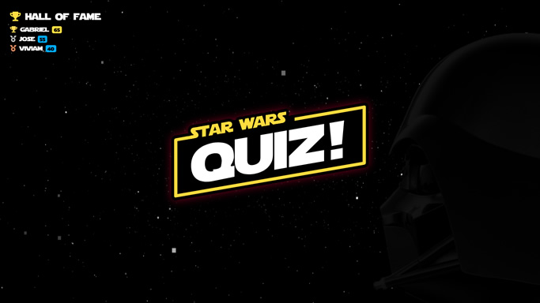
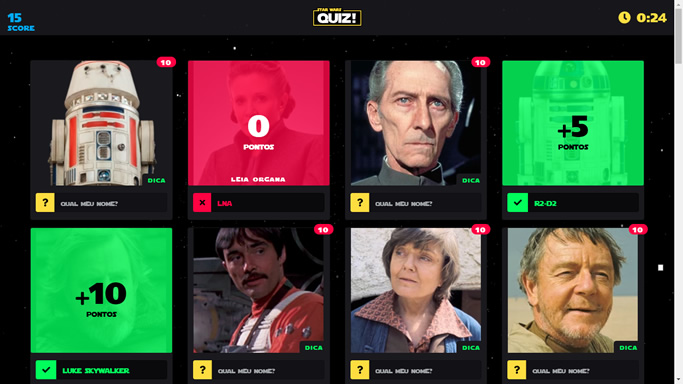
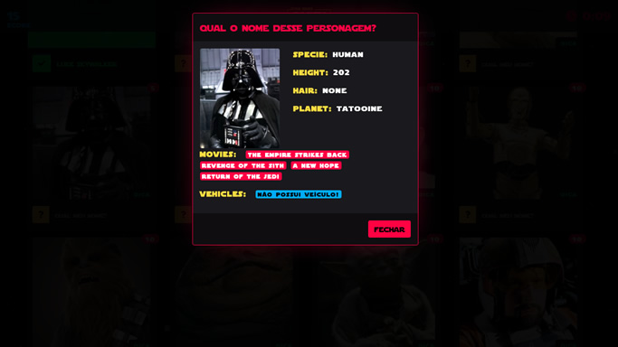
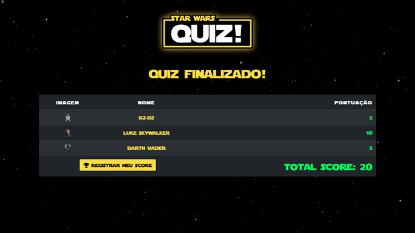

# StarWarsQuiz
    

> You know all characters of Star Wars ?

## ScreenShots

 
 

## Installation

How to install ?

```sh
git clone <linkRepo>
npm i
cd starwarsquiz
ng serve
```

## Meta

Pedro Hymino – [Linkedin](https://linkedin.com/in/pedrohymino/) – pedrohymino@gmail.com
[https://bitbucket.org/pedrohymino/](https://bitbucket.org/pedrohymino/)
[https://github.com/yourname/github-link](https://github.com/pedrohymino)